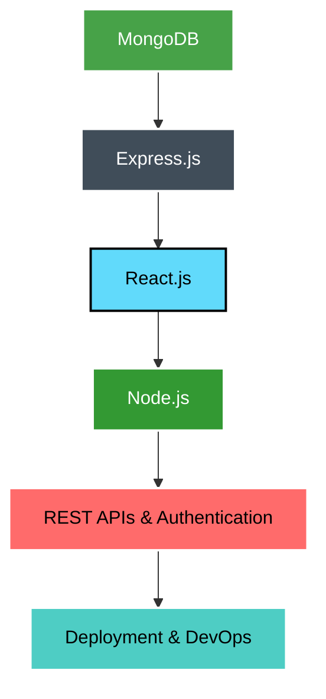

#  Welcome to Roshan Ghimire Github
<div align="center">
  
</div>

<div align="center">
  
</div>

<div align="center">
  
</div>

##  About Me


```Node JS
class RoshanProfile {
  constructor() {
    this.name = "Roshan";
    this.role = "MERN Stack Developer";
    this.location = "Nepal";
    this.education = "BCA";
    this.passion = ["Coding", "Problem Solving", "Web Development"];
    this.focus = {
      learning: ["MongoDB", "Express.js", "React.js", "Node.js", "MUI"],
      building: ["Portfolio", "Food Access Management System", "Grocery Store", "Tik Tak Toe", "Medical Website"],
      exploring: ["Full-stack Integration", "REST APIs", "Authentication & Security", "Deployment"],
    };
    this.funFact = "I debug faster after coffee";
  }
}
const me = new RoshanProfile();
me.showProfile();


```

<div align="center">
  
</div>

##  Tech Arsenal

</div>

### 🔒 **MERN STACK DEVELOPER**
<div align="center">
  


</div>

<div align="center">
  
</div>

##  GitHub Analytics

<div align="center">
   
  
</div>

<div align="center">
  
</div>

###  Activity Graph
<div align="center">
  
</div>

##  Contribution Snake
<div align="center">
  
<!-- GitHub Snake Animation -->
<picture>
  <source media="(prefers-color-scheme: dark)" srcset="https://github.com/RoshanGhimire00/RoshanGhimire00/blob/output/github-contribution-grid-snake-dark.svg" />
  <source media="(prefers-color-scheme: light)" srcset="https://github.com/RoshanGhimire00/RoshanGhimire00/blob/output/github-contribution-grid-snake.svg" />
  
</picture>

</div>


##  Featured Projects

<div align="center">
  
[](https://github.com/RoshanGhimire00/AI-ChatBot)
[](https://github.com/RoshanGhimire00/ML-AutomationSuite)

</div>

##  Current Learning Journey

<div align="center">
  


</div>

##  Let's Connect & Collaborate

<div align="center">
  
[](https://www.linkedin.com/in/ghimireroshan/)
[](https://twitter.com/yourhandle)
[](mailto:ghimireroshan00@gmail.com)
[](https://github.com/RoshanGhimire00)
[](https://your-portfolio.com)

</div>

<div align="center">
  
</div>

##  Fun Stats & Achievements

<div align="center">
  


</div>

### 🏆 GitHub Achievements
<div align="center">
  
</div>

---

<div align="center">
  
</div>

<div align="center">
  <i>"Your time is limited, so don’t waste it living someone else’s life.” – Steve Jobs</i>
  <br><br>
  <b>⭐ Don't forget to star my repositories if you find them interesting!</b>
</div>
